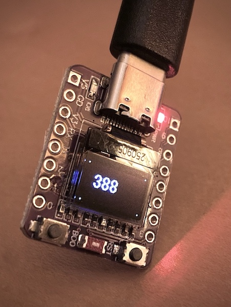

# ESP32-C3-OLED-TESTS

## Description

This is just a working space of programs for the "ESP32 C3 OLED" microcontroller that I picked up for a few dollars off of the internet.  Documentation is pretty sparse, unfortunately, and the onboard OLED display is implemented very strangely.

Also of note: I've been flashing the board from the Arduino IDE with the "DFRobot Beetle ESP32-C3" as the board type for the firmware builds, and it seems to be working out just fine.

## Sketches

- [blink-and-count.ino](blink-and-count/blink-and-count.ino)
    - Does more or less what it says; counts up and flashes the corner pixels once a second.  This was written to establish the correct offsets for the display.