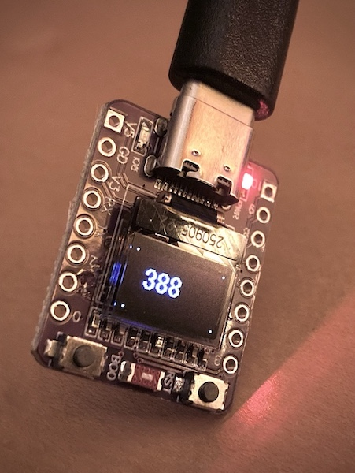

# ESP32-C3-OLED-TESTS



## Description

This is just a working space of programs for the "ESP32 C3 OLED" microcontroller that I picked up for a few dollars off of the internet.  Documentation is pretty sparse, unfortunately, and the onboard OLED display is implemented very strangely.

Also of note: I've been flashing the board from the Arduino IDE with the "DFRobot Beetle ESP32-C3" as the board type for the firmware builds, and it seems to be working out just fine.

## Sketches

- [blink-and-count.ino](blink-and-count/blink-and-count.ino)
    - Does more or less what it says; counts up and flashes the corner pixels once a second.  This was written to establish the correct offsets for the display.

## Useful Links

- [u8g2lib Reference Wiki](https://github.com/olikraus/u8g2/wiki/u8g2reference)
    - For looking up built-in functions for the display driver code

## Crash Debugging

Dump:

```
ELF file SHA256: 7db6e31f6

Rebooting...
ESP-ROM:esp32c3-api1-20210207
Build:Feb  7 2021
rst:0xc (RTC_SW_CPU_RST),boot:0xc (SPI_FAST_FLASH_BOOT)
Saved PC:0x40381950
SPIWP:0xee
mode:DIO, clock div:1
load:0x3fcd5820,len:0x1148
load:0x403cc710,len:0xb40
load:0x403ce710,len:0x2f58
entry 0x403cc710
Guru Meditation Error: Core  0 panic'ed (Load access fault). Exception was unhandled.

Core  0 register dump:
MEPC    : 0x42003780  RA      : 0x42003846  SP      : 0x3fca18c0  GP      : 0x3fc8fe00  
TP      : 0x3fca19c0  T0      : 0x4005890e  T1      : 0x3fca150c  T2      : 0x00000000  
S0/FP   : 0x3fc92f18  S1      : 0x00000020  A0      : 0x3fc92f18  A1      : 0x00000020  
A2      : 0x0000000a  A3      : 0x00000020  A4      : 0x00000040  A5      : 0x00000017  
A6      : 0x3fca1808  A7      : 0x00000000  S2      : 0x0000001c  S3      : 0x00000020  
S4      : 0x0000ffff  S5      : 0x0000fffe  S6      : 0x00000002  S7      : 0x00000003  
S8      : 0x00000000  S9      : 0x00000000  S10     : 0x00000000  S11     : 0x00000000  
T3      : 0x00000000  T4      : 0x00000000  T5      : 0x00000000  T6      : 0x00000000  
MSTATUS : 0x00001881  MTVEC   : 0x40380001  MCAUSE  : 0x00000005  MTVAL   : 0x00000018  
MHARTID : 0x00000000  

Stack memory:
3fca18c0: 0x0000001c 0x0000000a 0x3fc92f18 0x42003846 0x00000000 0x00000000 0x00000000 0x3fca192d
3fca18e0: 0x3fc92f18 0x0000000a 0x0000001c 0x420038d6 0x00000000 0x3fc98000 0x00000000 0x00000000
3fca1900: 0x3fc93000 0x3c0c0000 0x3c0c0000 0x3fc98000 0x00000000 0x3fc98000 0x3fc93000 0x420001b0
3fca1920: 0x00000015 0xffffffff 0xffffffff 0x6e6f4320 0x7463656e 0x20676e69 0x57206f74 0x20694669
3fca1940: 0x00002e2e 0x00000000 0x42007916 0xee73a760 0x00000000 0x00000000 0x00000000 0x00000000
3fca1960: 0x00000000 0x00000000 0x00000000 0x00000000 0x00000000 0x00000000 0x00000000 0x4200793c
3fca1980: 0x00000000 0x00000000 0x00000000 0x40388714 0x00000000 0x00000000 0x00000000 0x00000000
3fca19a0: 0x00000000 0x00000000 0x00000000 0x00000000 0x00000000 0xa5a5a5a5 0xa5a5a5a5 0xa5a5a5a5
3fca19c0: 0xa5a5a5a5 0xbaad5678 0x00000000 0x3fca1780 0x00000005 0x00000000 0x00000001 0x00000000
3fca19e0: 0x3fc9d688 0x42012134 0x0000219e 0x00000000 0x3fc99078 0x3fc990e0 0x3fc99148 0x00000000
3fca1a00: 0x00000000 0x00000001 0x00000000 0x00000000 0x00000000 0x4201187e 0x00000000 0x00000000
3fca1a20: 0x00000000 0x00000000 0x00000000 0x00000000 0x00000000 0x00000000 0x00000000 0x00000000
3fca1a40: 0x00000000 0x00000000 0x00000000 0x00000000 0x00000000 0x00000000 0x00000000 0x00000000
3fca1a60: 0x00000000 0x00000000 0x00000000 0x00000000 0x00000000 0x00000000 0x00000000 0x00000000
3fca1a80: 0x00000000 0x00000000 0x00000000 0x00000000 0x00000000 0x00000000 0x00000000 0x00000000
3fca1aa0: 0x00000000 0x00000000 0x00000000 0x00000000 0x00000000 0x00000000 0x00000000 0x00000000
3fca1ac0: 0x00000000 0x00000000 0x00000000 0x00000000 0x00000000 0x00000000 0x00000000 0x00000000
3fca1ae0: 0x00000000 0xbaad5678 0x509cfa72 0x3fca1978 0x00000068 0xabba1234 0x0000005c 0x00000000
3fca1b00: 0x3fca1afc 0x00000000 0x00000000 0x00000000 0x3fca1b14 0xffffffff 0x3fca1b14 0x3fca1b14
3fca1b20: 0x00000000 0x3fca1b28 0xffffffff 0x3fca1b28 0x3fca1b28 0x00000001 0x00000001 0x00000000
3fca1b40: 0x6600ffff 0x00000000 0xb649f8d3 0x24efc701 0xf5059044 0x8446b3f6 0xbaad5678 0x00000090
3fca1b60: 0xabba1234 0x00000080 0x76da3b8b 0xe3b6bd45 0xdc20934c 0xca1a6ab8 0xfd96f663 0xb4239279
3fca1b80: 0x7921f3a2 0xb565604d 0xd97ea73f 0x879fb910 0x388766f2 0x01d3ef90 0xd7de9482 0x8de3c55b
3fca1ba0: 0xe7ef3eb2 0x9a7f74dd 0xe47602af 0x8aa56f22 0x6b85b126 0x0ffd20b6 0x3fc9f9b4 0x00000170
3fca1bc0: 0xabba1234 0x0000015c 0x3fca1670 0x00000156 0x3fc93c78 0x3fc93c78 0x3fca1bc8 0x3fc93c70
3fca1be0: 0x00000018 0x3fca23f4 0x3fca23f4 0x3fca1bc8 0x00000000 0x00000001 0x3fc9f9c4 0x706f6f6c
3fca1c00: 0x6b736154 0x00000000 0x00000000 0x3fca19c0 0x00000005 0x00000000 0x00000001 0x00000000
3fca1c20: 0x3fc9d634 0x42012134 0x00001fe8 0x00000000 0x3fc99078 0x3fc990e0 0x3fc99148 0x00000000
3fca1c40: 0x00000000 0x00000001 0x00000000 0x00000000 0x00000000 0x4201187e 0x00000000 0x00000000
3fca1c60: 0x00000000 0x00000000 0x00000000 0x00000000 0x00000000 0x00000000 0x00000000 0x00000000
3fca1c80: 0x00000000 0x00000000 0x00000000 0x00000000 0x00000000 0x00000000 0x00000000 0x00000000
3fca1ca0: 0x00000000 0x00000000 0x00000000 0x00000000 0x00000000 0x00000000 0x00000000 0x00000000


ELF file SHA256: 7db6e31f6

Rebooting...
ESP-ROM:esp32c3-api1-20210207
Build:Feb  7 2021
rst:0xc (RTC_SW_CPU_RST),boot:0xc (SPI_FAST_FLASH_BOOT)
Saved PC:0x40381950
SPIWP:0xee
mode:DIO, clock div:1
load:0x3fcd5820,len:0x1148
load:0x403cc710,len:0xb40
load:0x403ce710,len:0x2f58
entry 0x403cc710

```